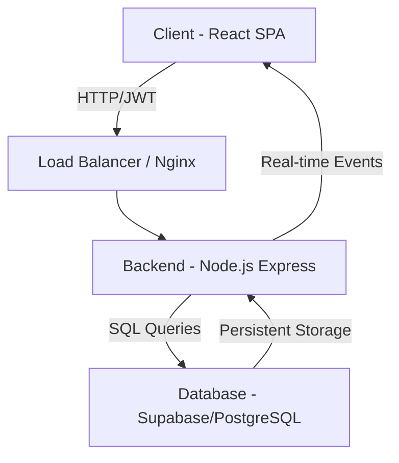
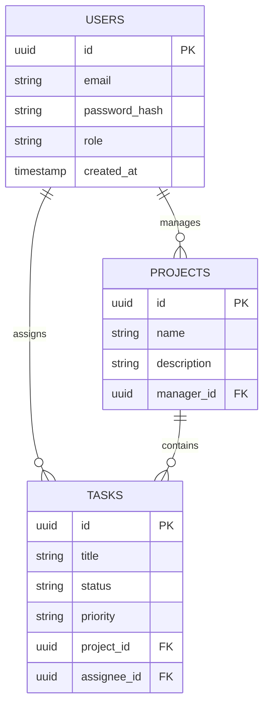

# Team Task Manager 🚀

### *Empowering Teams with Seamless Collaboration and Task Orchestration*

[](https://opensource.org/licenses/MIT)
[](https://nodejs.org/)
[](https://reactjs.org/)
[](https://supabase.com/)
[]()
[](https://github.com/your-username/team-task-manager/pulls)

**Team Task Manager** is a production-grade, enterprise-ready task and project management solution designed for modern high-performance teams. Built with a focus on scalability, security, and developer experience, it provides a centralized hub for managing complex workflows, tracking team progress, and ensuring accountability across the entire organization.

---

## 📍 Quick Navigation

- [Project Overview](#-project-overview)
- [Features](#-features)
- [Tech Stack](#-tech-stack)
- [System Architecture](#-system-architecture)
- [Installation Guide](#-installation-guide)
- [API Documentation](#-api-documentation)
- [Security Practices](#-security-practices)
- [Roadmap](#-roadmap)

---

## 📖 Project Overview

### The Business Problem
Modern teams often struggle with fragmented communication, opaque progress tracking, and disorganized task management. Using multiple disconnected tools leads to data silos, missed deadlines, and decreased productivity.

### Our Solution
Team Task Manager bridges this gap by providing a **unified orchestration layer**. It combines robust project planning with granular task tracking and role-based access control, ensuring that every team member knows exactly what to do, when to do it, and how their work impacts the broader mission.

### Key Advantages
*   **Centralized Truth:** One source of truth for all projects and tasks.
*   **Role-Based Control:** Granular permissions for admins, managers, and contributors.
*   **Real-time Visibility:** Instant updates on task status and project health.
*   **Dark Mode Support:** Optimized for long work sessions with a premium dark interface.

---

## ✨ Features

### 🏢 Project Management
*   **Hierarchical Organization:** Organize tasks under specific projects.
*   **Project Lifecycles:** Track projects from initiation to completion.
*   **Resource Allocation:** Assign team members to specific projects.

### ✅ Task Orchestration
*   **Dynamic Status Tracking:** (To-Do, In Progress, Review, Completed).
*   **Priority Management:** Categorize tasks by urgency (Low, Medium, High).
*   **Collaborative Assignment:** Assign tasks to multiple users with clear ownership.
*   **Deadline Monitoring:** Real-time countdowns and overdue alerts.

### 👥 User & Role Administration
*   **RBAC (Role-Based Access Control):** Secure administrative dashboard for user management.
*   **Profile Management:** Individual user settings and performance tracking.
*   **Audit Readiness:** Track who created and modified tasks.

---

## 🛠 Tech Stack

| Category | Technology | Purpose |
| :--- | :--- | :--- |
| **Frontend** | React 18, Vite | High-performance SPA with fast HMR |
| **Styling** | Tailwind CSS | Utility-first responsive design |
| **Icons** | Lucide React | Modern, consistent iconography |
| **State** | React Context API | Global authentication and application state |
| **Backend** | Node.js, Express | Scalable RESTful API architecture |
| **Database** | Supabase (PostgreSQL) | Reliable, relational data persistence |
| **Auth** | JWT, BcryptJS | Secure, stateless authentication flow |
| **Validation** | Express Validator | Robust server-side data sanitization |
| **DevOps** | Docker | Containerized deployment environment |

---

## 🏗 System Architecture

The system follows a decoupled **Client-Server Architecture** utilizing a RESTful communication pattern and a centralized PostgreSQL database hosted on Supabase.

### Application Flow


### Database ERD


---

## 📂 Folder Structure

```bash
team-task-manager/
├── client/                 # Frontend React Application
│   ├── src/
│   │   ├── api/            # Axios instance and API service calls
│   │   ├── components/     # Reusable UI components
│   │   ├── context/        # Auth and Theme context providers
│   │   ├── pages/          # Full page views (Dashboard, Tasks, etc.)
│   │   ├── hooks/          # Custom React hooks
│   │   └── utils/          # Formatting and helper functions
│   ├── vite.config.js      # Vite build configuration
│   └── tailwind.config.js  # Styling configuration
├── server/                 # Backend Node.js API
│   ├── src/
│   │   ├── controllers/    # Request handlers and business logic
│   │   ├── models/         # Database interaction logic
│   │   ├── routes/         # API endpoint definitions
│   │   ├── middleware/     # Auth, Error, and Validation filters
│   │   └── config/         # Environment and database config
│   ├── server.js           # API Entry point
│   └── .env.example        # Environment template
└── docker-compose.yml      # Container orchestration
```

---

## 🚀 Installation Guide

### Prerequisites
*   Node.js (v18.x or higher)
*   NPM or PNPM
*   Supabase Account

### 1. Clone the Repository
```bash
git clone https://github.com/your-username/team-task-manager.git
cd team-task-manager
```

### 2. Backend Setup
```bash
cd server
npm install
cp .env.example .env
# Update .env with your Supabase credentials
npm run dev
```

### 3. Frontend Setup
```bash
cd ../client
npm install
npm run dev
```

### 4. Docker Deployment
```bash
docker-compose up --build
```

---

## 🔐 Environment Variables

### Backend (`/server/.env`)
| Variable | Description | Required | Example |
| :--- | :--- | :--- | :--- |
| `SUPABASE_URL` | Your Supabase Project URL | Yes | `https://xyz.supabase.co` |
| `SUPABASE_ANON_KEY` | Supabase Anon Key | Yes | `eyJhbGciOiJIUzI1...` |
| `JWT_SECRET` | Secret key for signing tokens | Yes | `your-secure-secret` |
| `PORT` | Server Port | No | `5000` |

---

## 📡 API Documentation

### Authentication Endpoints
| Method | Endpoint | Description | Auth Required |
| :--- | :--- | :--- | :--- |
| `POST` | `/api/auth/register` | Create a new account | No |
| `POST` | `/api/auth/login` | Log in and receive JWT | No |

### Task Endpoints
| Method | Endpoint | Description | Auth Required |
| :--- | :--- | :--- | :--- |
| `GET` | `/api/tasks` | Fetch all tasks | Yes |
| `POST` | `/api/tasks` | Create a new task | Yes |
| `PATCH` | `/api/tasks/:id` | Update task status/assignee | Yes |

---

## 🛡 Security Practices

*   **JWT Implementation:** Stateless authentication with secure HTTP headers.
*   **Helmet.js:** Automated security headers to prevent common attacks like Clickjacking.
*   **Bcrypt Password Hashing:** Salted hashes for user passwords (cost factor 10).
*   **Input Sanitization:** Express-validator used to prevent SQL injection and XSS.
*   **CORS Policy:** Strict origin control for API access.

---

## 🛣 Roadmap

- [x] Core Authentication System
- [x] Project and Task CRUD operations
- [x] Role-Based Access Control
- [/] Real-time Dashboard Analytics
- [ ] Slack/Microsoft Teams Integration
- [ ] Mobile Application (React Native)
- [ ] AI-Powered Task Estimation

---

## 🤝 Contribution Guidelines

1.  **Fork** the repository.
2.  **Create** your feature branch (`git checkout -b feature/AmazingFeature`).
3.  **Commit** your changes (`git commit -m 'Add AmazingFeature'`).
4.  **Push** to the branch (`git push origin feature/AmazingFeature`).
5.  **Open** a Pull Request.

---

## 📜 License
Distributed under the **MIT License**. See `LICENSE` for more information.

---

## 📬 Support & Contact

**Maintainer:** Your Name
**Email:** contact@example.com
**Website:** [your-portfolio.com](https://your-portfolio.com)

---

<div align="center">
  <p>Built with ❤️ by the Team Task Manager Community</p>
  <sub>© 2026 Team Task Manager. All rights reserved.</sub>
</div>